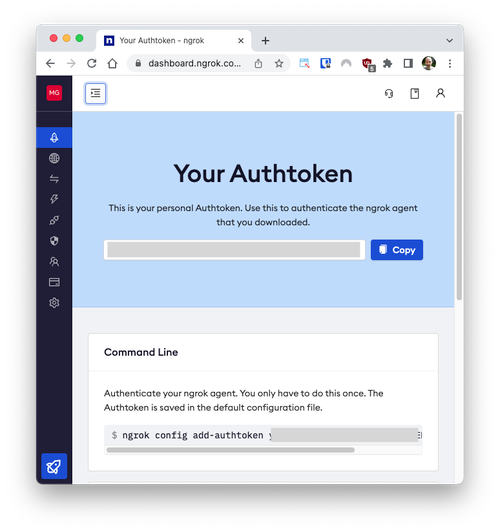

<div align="center">

[](https://www.resumematcher.fyi)

# Resume Matcher

[𝙹𝚘𝚒𝚗 𝙳𝚒𝚜𝚌𝚘𝚛𝚍](https://dsc.gg/resume-matcher) ✦ [𝚆𝚎𝚋𝚜𝚒𝚝𝚎](https://resumematcher.fyi) ✦ [𝙳𝚎𝚖𝚘](https://resume-matcher.streamlit.app/) ✦ [𝙷𝚘𝚠 𝚝𝚘 𝙸𝚗𝚜𝚝𝚊𝚕𝚕 ](#how-to-install) ✦ [𝙲𝚘𝚗𝚝𝚛𝚒𝚋𝚞𝚝𝚎](#join-us-contribute) ✦ [𝙳𝚘𝚗𝚊𝚝𝚎](#please-support-the-development-by-donating) ✦ [𝚃𝚠𝚒𝚝𝚝𝚎𝚛](https://twitter.com/_srbhr_)

---


### Resume Matcher is an AI Based Free & Open Source Tool. To tailor your resume to a job description. Find the matching keywords, improve the readability  and gain deep insights into your resume.

</div>

<br>

<div align="center">


   

[](https://discord.gg/t3Y9HEuV34) [](https://twitter.com/_srbhr_)
[](https://www.resumematcher.fyi)

Upvote us on [ProductHunt 🚀](https://www.producthunt.com/products/resume-matcher).

<a href="https://www.producthunt.com/posts/resume-matcher?utm_source=badge-featured&utm_medium=badge&utm_souce=badge-resume&#0045;matcher" target="_blank"></a>

</div>

<div align="center">

**Don't let your resume be a roadblock from getting your next job. Use Resume Matcher!**


## How does it work?

</div>

The Resume Matcher takes your resume and job descriptions as input, parses them using Python, and mimics the functionalities of an ATS, providing you with insights and suggestions to make your resume ATS-friendly.

The process is as follows:

1. **Parsing**: The system uses Python to parse both your resume and the provided job description, just like an ATS would.

2. **Keyword Extraction**: The tool uses advanced machine learning algorithms to extract the most relevant keywords from the job description. These keywords represent the skills, qualifications, and experiences the employer seeks.

3. **Key Terms Extraction**: Beyond keyword extraction, the tool uses textacy to identify the main key terms or themes in the job description. This step helps in understanding the broader context of what the resume is about.

4. **Vector Similarity Using FastEmbed**: The tool uses [FastEmbed](https://github.com/qdrant/fastembed), a highly efficient embedding system, to measure how closely your resume matches the job description. The more similar they are, the higher the likelihood that your resume will pass the ATS screening.

<br/>

<div align="center">

## 🚀 Recent Updates (February 11, 2025)

### Bug Fixes and Improvements
1. **Fixed Document Processing Issues**
   - Resolved embedding dimension mismatch between Cohere API and database
   - Updated database schema to accept 1024-dimensional vectors
   - Added detailed error logging and status messages throughout the process
   - Improved error handling and user feedback in the UI

2. **Architecture Improvements**
   - Combined analyze and process-analysis endpoints for simpler workflow
   - Added proper error handling and status updates
   - Improved state management in the dashboard component

3. **Database Updates**
   - Modified vector dimensions from 4096 to 1024 to match Cohere model output
   - Updated match_documents function for compatibility
   - Added migration scripts for database changes

### Current Status
- ✅ Document upload and processing
- ✅ Embedding generation with Cohere API
- ✅ Vector similarity matching
- ✅ Real-time status updates
- ✅ Error handling and user feedback

### Next Steps
1. Add more detailed analysis results
2. Implement batch processing for multiple documents
3. Add progress tracking for large documents
4. Enhance error recovery mechanisms

</div>

<div align="center">

## How to install

</div>

Follow these steps to set up the environment and run the application.

1. Fork the repository [here](https://github.com/srbhr/Resume-Matcher/fork).

2. Clone the forked repository.

   ```bash
   git clone https://github.com/<YOUR-USERNAME>/Resume-Matcher.git
   cd Resume-Matcher
   ```

3. Create a Python Virtual Environment:

   - Using [virtualenv](https://learnpython.com/blog/how-to-use-virtualenv-python/):

     _Note_: Check how to install virtualenv on your system here [link](https://learnpython.com/blog/how-to-use-virtualenv-python/).

     ```bash
     virtualenv env
     ```

   **OR**

   - Create a Python Virtual Environment:

     ```bash
     python -m venv env
     ```

4. Activate the Virtual Environment.

   - On Windows.

     ```bash
     env\Scripts\activate
     ```

   - On macOS and Linux.

     ```bash
     source env/bin/activate
     ```

    **OPTIONAL (For pyenv users)**

   Run the application with pyenv (Refer this [article](https://realpython.com/intro-to-pyenv/#installing-pyenv))

   - Build dependencies (on ubuntu)
      ```
      sudo apt-get install -y make build-essential libssl-dev zlib1g-dev libbz2-dev libreadline-dev libsqlite3-dev wget curl llvm libncurses5-dev libncursesw5-dev xz-utils tk-dev libffi-dev liblzma-dev python openssl
      ```
      ```

      sudo apt-get install build-essential zlib1g-dev libffi-dev libssl-dev libbz2-dev libreadline-dev libsqlite3-dev liblzma-dev libncurses-dev

      sudo apt-get install python-tk python3-tk tk-dev

      sudo apt-get install build-essential zlib1g-dev libffi-dev libssl-dev libbz2-dev libreadline-dev libsqlite3-dev liblzma-dev

      ```
   - pyenv installer
     ```
        curl https://pyenv.run | bash
     ```
   - Install desired python version
     ```
       pyenv install -v 3.11.0
     ```

   - pyenv with virtual environment
     ```
        pyenv virtualenv 3.11.0 venv
     ```

   - Activate virtualenv with pyenv
     ```
        pyenv activate venv
     ```

5. Install Dependencies:

   ```bash
   pip install -r requirements.txt
   ```

6. Prepare Data:

   - Resumes: Place your resumes in PDF format in the `Data/Resumes` folder. Remove any existing contents in this folder.
   - Job Descriptions: Place your job descriptions in PDF format in the `Data/JobDescription` folder. Remove any existing contents in this folder.

7. Parse Resumes to JSON:

   ```python
   python run_first.py
   ```

8. Run the Application:

   ```python
   streamlit run streamlit_app.py
   ```

**Note**: For local versions, you do not need to run "streamlit_second.py" as it is specifically for deploying to Streamlit servers.

**Additional Note**: The Vector Similarity part is precomputed to optimize performance due to the resource-intensive nature of sentence encoders that require significant GPU and RAM resources. If you are interested in leveraging this feature in a Google Colab environment for free, refer to the upcoming blog (link to be provided) for further guidance.

<br/>

### Docker

1. Build the image and start application

   ```bash
       docker-compose up
   ```

2. Open `localhost:80` on your browser

<br/>

### Running the Web Application

The full stack Next.js (React and FastAPI) web application allows users to interact with the Resume Matcher tool interactively via a web browser.

> [!WARNING]
> The results returned from through the web app are currently entirely mocked / faked. This means that the results returned are not real and are just for demonstration purposes. This will be implemented with real data results in a future release.

To run the full stack web application (frontend client and backend api servers), follow the instructions over on the [webapp README](/webapp/README.md) file.

<br/>

### Google Colab
1. Create an account in ngrok and get you token
2. 
3. Go to archive/resume_matcher_colab.ipynb and run the notebook.
4. Enter your ngrok token and run the notebook.
5. Copy the url and open it in your browser.
6. 

## How to Use

1. **Basic Usage**
   ```bash
   python -m resume_matcher.scripts <resume_file> <job_file> --mode full --output json
   ```

2. **Testing Components**
   ```bash
   # Test text cleaning
   python test_clean.py
   
   # Test Cohere API integration
   python test_cohere.py
   
   # Test complete process
   python test_process.py
   ```

3. **Environment Setup**
   - Create a `.env` file with your API keys:
     ```
     COHERE_API_KEY=your_key_here
     QDRANT_API_KEY=your_key_here
     QDRANT_URL=your_url_here
     ```

## Code Formatting

This project uses [Black](https://black.readthedocs.io/en/stable/) for code formatting. We believe this helps to keep the code base consistent and reduces the cognitive load when reading code.

Before submitting your pull request, please make sure your changes are in accordance with the Black style guide. You can format your code by running the following command in your terminal:

```sh
black .
```

## Pre-commit Hooks

We also use [pre-commit](https://pre-commit.com/) to automatically check for common issues before commits are submitted. This includes checks for code formatting with Black.

If you haven't already, please install the pre-commit hooks by running the following command in your terminal:

```sh
pip install pre-commit
pre-commit install
```

Now, the pre-commit hooks will automatically run every time you commit your changes. If any of the hooks fail, the commit will be aborted.


## Join Us, Contribute!


Pull Requests & Issues are not just welcomed, they're celebrated! Let's create together.

🎉 Join our lively [Discord](https://dsc.gg/resume-matcher) community and discuss away!

💡 Spot a problem? Create an issue!

👩‍💻 Dive in and help resolve existing [issues](https://github.com/srbhr/Resume-Matcher/issues).

🔔 Share your thoughts in our [Discussions & Announcements](https://github.com/srbhr/Resume-Matcher/discussions).

🚀 Explore and improve our [Landing Page](https://github.com/srbhr/website-for-resume-matcher). PRs always welcome!

📚 Contribute to the [Resume Matcher Docs](https://github.com/srbhr/Resume-Matcher-Docs) and help people get started with using the software.

#### Tech Stack

       

<br/>

<div align="center">

## Please support the development by donating.

[](https://buymeacoffee.com/srbhr)
[](https://github.com/sponsors/srbhr)

</div>

---

### Heads Up! 📝

Your support means the world to us 💙. We're nurturing this project with an open-source community spirit, and we have an ambitious roadmap ahead! Here are some ways you could contribute and make a significant impact:

✨ Transform our Streamlit dashboard into something more robust.

💡 Improve our parsing algorithm, making data more accessible.

🖋 Share your insights and experiences in a blog post to help others.

Take the leap, contribute, and let's grow together! 🚀

---

### Our Contributors ✨

<a href="https://github.com/srbhr/Resume-Matcher/graphs/contributors">
  
</a>

# MatchPro Resume

A powerful resume analysis tool that helps match resumes with job descriptions using advanced AI techniques. Originally built in Python, now completely rewritten in Next.js for better performance, scalability, and user experience.

## Features

- 📄 Resume and job description analysis
- 🤖 AI-powered matching
- 📊 Detailed match scoring
- 🔒 Secure data handling
- ✅ Comprehensive testing
- ⚡ Modern Next.js architecture
- 🎯 TypeScript for better reliability
- 🔄 Real-time updates with Supabase

## Technology Stack

- **Frontend**: Next.js, React, TypeScript
- **Backend**: Next.js API routes
- **Database**: Supabase (PostgreSQL)
- **AI/ML**: Cohere API
- **Testing**: Playwright
- **Authentication**: Supabase Auth
- **File Storage**: Supabase Storage

## Migration from Python

This project was originally built using Python (Flask) and SQLite. We've completely migrated to a modern stack:

- Replaced Flask with Next.js for better performance and developer experience
- Migrated from SQLite to Supabase (PostgreSQL) for better scalability
- Implemented real-time features using Supabase subscriptions
- Added TypeScript for improved type safety and developer experience
- Enhanced UI with modern React components
- Improved testing with Playwright end-to-end tests

## Getting Started

### Prerequisites

- Node.js 18+
- Supabase account
- Cohere API key

### Environment Setup

Create a `.env.local` file with the following variables:

```env
# Supabase Configuration
NEXT_PUBLIC_SUPABASE_URL=your_supabase_url
NEXT_PUBLIC_SUPABASE_ANON_KEY=your_anon_key
SUPABASE_SERVICE_ROLE_KEY=your_service_role_key

# API Keys
COHERE_API_KEY=your_cohere_api_key
```

### Installation

1. Clone the repository:
```bash
git clone https://github.com/yourusername/MatchPro-Resume.git
cd MatchPro-Resume
```

2. Install dependencies:
```bash
npm install
```

3. Run database migrations:
```bash
npx supabase migration up
```

4. Start the development server:
```bash
npm run dev
```

## Testing

We use Playwright for end-to-end testing. To run the tests:

```bash
# Install Playwright browsers
npx playwright install

# Run tests
npm test

# Run tests with debug mode
npx playwright test --debug
```

### Test Files
- `tests/process-analysis.spec.ts`: Tests the analysis workflow
- `tests/setup.ts`: Test environment setup

## Database Schema

### Tables

1. `analyses`
   - Stores analysis records
   - Protected by Row Level Security (RLS)
   - Fields: id, user_id, status, results, etc.

2. `document_embeddings`
   - Stores document content and embeddings
   - Protected by RLS
   - Fields: id, content, metadata, embedding

## API Endpoints

### POST /api/analyze
Analyzes a resume against a job description.

**Request:**
```http
POST /api/analyze
Content-Type: multipart/form-data

- resume: File
- jobDescription: File
- userId: string
```

**Response:**
```json
{
  "message": "Analysis completed successfully",
  "analysisId": "uuid"
}
```

## Security

- Row Level Security (RLS) policies protect all database tables
- Service role access for testing and administrative functions
- Secure file handling and storage
- Environment variable validation

## Contributing

1. Fork the repository
2. Create your feature branch (`git checkout -b feature/amazing-feature`)
3. Commit your changes (`git commit -m 'Add some amazing feature'`)
4. Push to the branch (`git push origin feature/amazing-feature`)
5. Open a Pull Request

## License

This project is licensed under the MIT License - see the LICENSE file for details.

## Acknowledgments

- Thanks to Supabase for the amazing database platform
- Thanks to Cohere for the powerful AI capabilities
- Thanks to Playwright for the excellent testing framework
